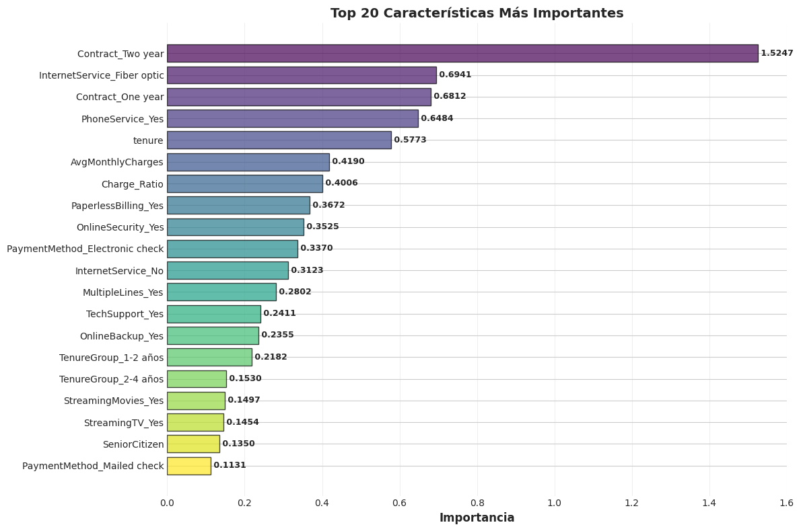
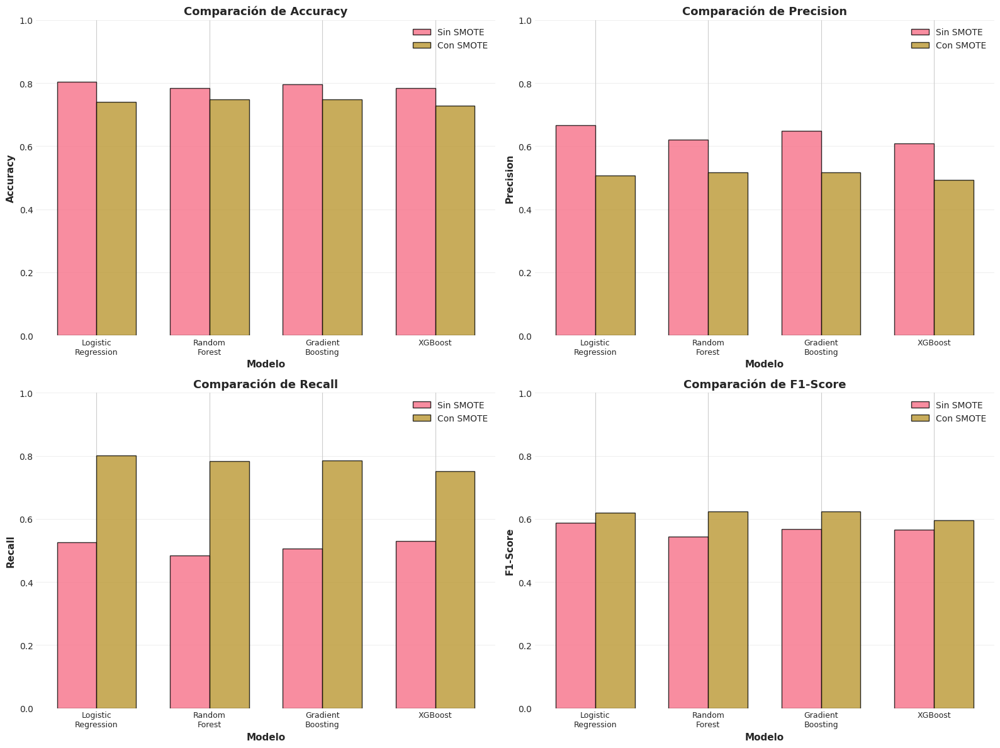
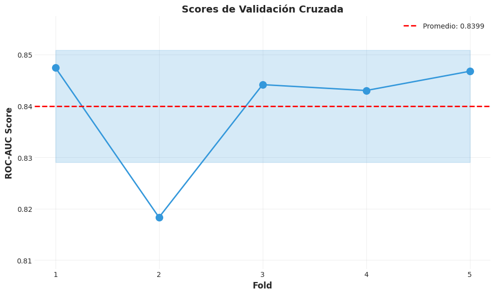
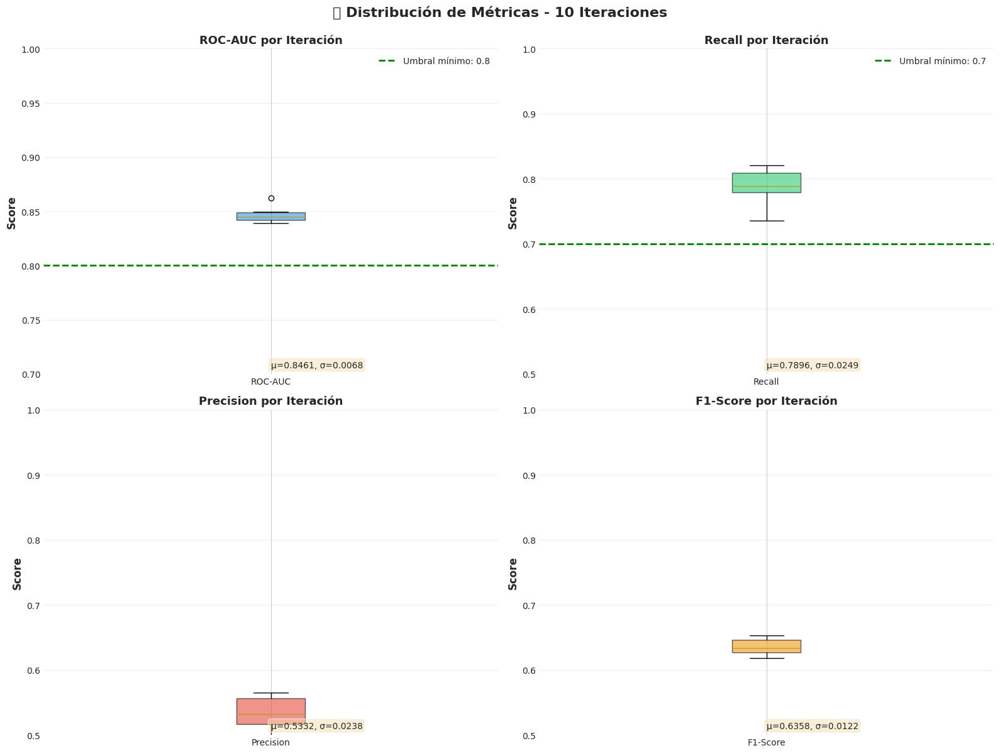

\newpage

# INTRODUCCIÓN TEÓRICA SOBRE EL CICLO DE VIDA DE PROYECTOS DE ML

## ¿Qué es Machine Learning?

El Machine Learning (ML) es una rama de la Inteligencia Artificial que permite a los sistemas aprender automáticamente a partir de datos, identificando patrones y tomando decisiones con mínima intervención humana. A diferencia de la programación tradicional donde se definen reglas explícitas, en ML el sistema aprende las reglas a partir de los datos.

## El Ciclo de Vida de un Proyecto de ML

El desarrollo de un proyecto de Machine Learning sigue un ciclo de vida estructurado que garantiza resultados reproducibles y de calidad. Las fases principales son:

### Fase 1: Definición del Problema
- **Identificación del problema de negocio**: ¿Qué queremos resolver?
- **Traducción a un problema de ML**: ¿Es clasificación, regresión, clustering?
- **Definición de métricas de éxito**: ¿Cómo mediremos el éxito?
- **Identificación de stakeholders**: ¿Quiénes se beneficiarán?

### Fase 2: Recolección y Comprensión de Datos
- **Identificación de fuentes de datos**: Bases de datos, APIs, archivos
- **Recolección de datos**: Extracción y almacenamiento
- **Exploración inicial**: Estructura, dimensiones, tipos de datos
- **Evaluación de calidad**: Completitud, consistencia, precisión

### Fase 3: Preparación de Datos
- **Limpieza de datos**: Tratamiento de valores faltantes, outliers
- **Transformación**: Encoding, normalización, estandarización
- **Feature Engineering**: Creación de nuevas variables derivadas
- **Selección de características**: Identificación de variables relevantes

### Fase 4: Modelado
- **Selección de algoritmos**: Baseline con múltiples modelos
- **Entrenamiento**: Ajuste de modelos a los datos
- **Validación cruzada**: Evaluación robusta del rendimiento
- **Optimización de hiperparámetros**: Búsqueda de parámetros óptimos

### Fase 5: Evaluación
- **Métricas de rendimiento**: Accuracy, Precision, Recall, F1-Score, ROC-AUC
- **Validación de robustez**: Evaluación con múltiples semillas
- **Interpretabilidad**: Análisis de importancia de features
- **Comparación con baseline**: Verificación de mejora

### Fase 6: Despliegue y Monitoreo
- **Deployment**: API, aplicación web, integración
- **Monitoreo**: Seguimiento del rendimiento en producción
- **Mantenimiento**: Reentrenamiento periódico
- **Documentación**: Registro de decisiones y resultados

## Importancia del Ciclo de Vida

Seguir un ciclo de vida estructurado permite:

- **Reproducibilidad**: Resultados consistentes entre ejecuciones
- **Trazabilidad**: Documentación de cada decisión
- **Calidad**: Validación en cada etapa
- **Escalabilidad**: Proceso repetible para nuevos proyectos

\newpage

# SELECCIÓN DEL CONTEXTO Y PROBLEMA ESPECÍFICO

## Contexto: Industria de Telecomunicaciones

La industria de telecomunicaciones enfrenta uno de los desafíos más críticos en la era digital: la **fuga de clientes** o **Customer Churn**. En un mercado altamente competitivo con múltiples proveedores de servicios, la retención de clientes se ha convertido en una prioridad estratégica.

### Realidad del Mercado de Telecomunicaciones

| Aspecto | Descripción |
|---------|-------------|
| **Competencia** | Múltiples operadores compiten por los mismos clientes |
| **Costos de Adquisición** | Adquirir un nuevo cliente cuesta 5-25x más que retener uno existente |
| **Saturación del Mercado** | Penetración cercana al 100% en muchos mercados |
| **Portabilidad** | Facilidad para cambiar de operador sin perder número |
| **Servicios Sustitutos** | Aplicaciones OTT (WhatsApp, Telegram) reducen uso de servicios tradicionales |

## Problema Específico: Predicción de Customer Churn

### Definición del Problema

**Customer Churn** (fuga de clientes) se refiere al fenómeno en el cual los clientes dejan de utilizar los servicios de una empresa para migrar a un competidor o simplemente cancelar su suscripción.

**Problema de negocio**: ¿Cómo podemos identificar proactivamente a los clientes con alta probabilidad de abandonar el servicio para implementar estrategias de retención antes de que sea demasiado tarde?

**Traducción a problema de ML**: Clasificación binaria supervisada donde:

- **Clase 0 (No Churn)**: Cliente permanece con la empresa
- **Clase 1 (Churn)**: Cliente abandona el servicio

### Stakeholders Identificados

| Stakeholder | Rol | Interés |
|-------------|-----|---------|
| **Departamento de Marketing** | Campañas de retención | Identificar clientes objetivo |
| **Servicio al Cliente** | Atención proactiva | Priorizar clientes en riesgo |
| **Dirección Comercial** | Estrategia de pricing | Ajustar ofertas competitivas |
| **Finanzas** | Proyección de ingresos | Estimar pérdidas potenciales |
| **Operaciones** | Calidad del servicio | Identificar problemas recurrentes |

### Métricas de Éxito del Proyecto

| Métrica | Umbral Mínimo | Objetivo |
|---------|---------------|----------|
| **ROC-AUC** | > 0.75 | > 0.85 |
| **Recall** | > 70% | > 80% |
| **F1-Score** | > 0.50 | > 0.60 |
| **Precision** | > 45% | > 55% |

> **Nota**: Priorizamos **Recall** porque es más costoso NO detectar un cliente que se irá (Falso Negativo) que generar una alerta incorrecta (Falso Positivo).


## Dataset Utilizado

### Origen y Descripción

El proyecto utiliza el dataset **Telco Customer Churn** de IBM, un conjunto de datos ampliamente utilizado en la comunidad de ciencia de datos para problemas de predicción de churn.

| Característica | Valor |
|----------------|-------|
| **Fuente** | IBM Sample Data Sets |
| **Registros** | 7,043 clientes |
| **Variables** | 21 columnas (20 features + 1 target) |
| **Formato** | CSV |
| **Archivo** | `WA_Fn-UseC_-Telco-Customer-Churn.csv` |

### Variables del Dataset

#### Variables Demográficas
| Variable | Tipo | Descripción |
|----------|------|-------------|
| `customerID` | String | Identificador único del cliente |
| `gender` | Categórica | Género (Male/Female) |
| `SeniorCitizen` | Binaria | Es adulto mayor (0/1) |
| `Partner` | Categórica | Tiene pareja (Yes/No) |
| `Dependents` | Categórica | Tiene dependientes (Yes/No) |

#### Variables de Servicios
| Variable | Tipo | Descripción |
|----------|------|-------------|
| `PhoneService` | Categórica | Servicio telefónico (Yes/No) |
| `MultipleLines` | Categórica | Múltiples líneas |
| `InternetService` | Categórica | Tipo de internet (DSL/Fiber optic/No) |
| `OnlineSecurity` | Categórica | Seguridad en línea |
| `OnlineBackup` | Categórica | Backup en línea |
| `DeviceProtection` | Categórica | Protección de dispositivo |
| `TechSupport` | Categórica | Soporte técnico |
| `StreamingTV` | Categórica | Streaming de TV |
| `StreamingMovies` | Categórica | Streaming de películas |

#### Variables de Cuenta
| Variable | Tipo | Descripción |
|----------|------|-------------|
| `Contract` | Categórica | Tipo de contrato (Month-to-month/One year/Two year) |
| `PaperlessBilling` | Categórica | Facturación sin papel (Yes/No) |
| `PaymentMethod` | Categórica | Método de pago |
| `MonthlyCharges` | Numérica | Cargo mensual ($) |
| `TotalCharges` | Numérica | Cargo total acumulado ($) |
| `tenure` | Numérica | Meses como cliente |

#### Variable Objetivo
| Variable | Tipo | Descripción |
|----------|------|-------------|
| `Churn` | Binaria | Abandono del cliente (Yes/No) |

\newpage

# ANÁLISIS EXPLORATORIO DE DATOS (EDA)

## Carga de Datos y Exploración Inicial

### Proceso de Carga

```python
# Cargar el dataset
df = pd.read_csv('WA_Fn-UseC_-Telco-Customer-Churn.csv')

# Inspección inicial
print(f"Dimensiones del dataset: {df.shape}")
# Resultado: (7043, 21)
```

### Información General del Dataset

| Métrica | Valor |
|---------|-------|
| **Total de Registros** | 7,043 |
| **Total de Columnas** | 21 |
| **Columnas Numéricas** | 3 (tenure, MonthlyCharges, TotalCharges) |
| **Columnas Categóricas** | 17 |
| **Columna ID** | 1 (customerID) |

## Evaluación de Calidad de Datos

### Análisis de Valores Faltantes

```python
# Verificar valores faltantes
df.isnull().sum()
```

| Problema Detectado | Cantidad | Solución |
|--------------------|----------|----------|
| Espacios en blanco en `TotalCharges` | 11 registros | Conversión a NaN y posterior imputación |
| Clientes con tenure=0 | 11 registros | Imputar TotalCharges = MonthlyCharges |

### Registros Duplicados

```python
# Verificar duplicados
print(f"Registros duplicados: {df.duplicated().sum()}")
# Resultado: 0
```

**Estado final**: Dataset limpio sin duplicados ni valores faltantes después del tratamiento.

## Tratamiento de Datos Ausentes

### Estrategia de Imputación

```python
# Detectar espacios en blanco en TotalCharges
df['TotalCharges'] = df['TotalCharges'].replace(' ', np.nan)
df['TotalCharges'] = pd.to_numeric(df['TotalCharges'], errors='coerce')

# Imputación lógica: clientes nuevos (tenure=0)
# tienen TotalCharges = MonthlyCharges
df['TotalCharges'] = df['TotalCharges'].fillna(df['MonthlyCharges'])
```

**Justificación**: Los 11 clientes con `TotalCharges` vacío son clientes nuevos con `tenure=0`, por lo que su cargo total acumulado debería ser igual a su primer cargo mensual.

## Normalización y Transformación

### Estandarización de Variables Numéricas

```python
from sklearn.preprocessing import StandardScaler

numerical_cols = ['tenure', 'MonthlyCharges', 'TotalCharges']
scaler = StandardScaler()
df[numerical_cols] = scaler.fit_transform(df[numerical_cols])
```

### Encoding de Variables Categóricas

```python
from sklearn.preprocessing import OneHotEncoder

# OneHotEncoder con drop='first' para evitar multicolinealidad
encoder = OneHotEncoder(drop='first', sparse_output=False)
```

| Antes del Encoding | Después del Encoding |
|--------------------|----------------------|
| 20 features | 39 features |
| Variables mixtas | Variables numéricas |


## Análisis Univariado

### Distribución de la Variable Objetivo (Churn)


| Categoría | Cantidad | Porcentaje |
|-----------|----------|------------|
| **No Churn** | 5,174 | 73.46% |
| **Sí Churn** | 1,869 | 26.54% |
| **Ratio de Desbalanceo** | 2.77:1 | - |

**Interpretación**: El dataset presenta un desbalanceo moderado con aproximadamente 1 de cada 4 clientes abandonando el servicio. Este desbalanceo debe considerarse durante el entrenamiento del modelo.

### Distribución de Variables Numéricas

#### Tenure (Antigüedad del Cliente)


- **Observación**: Distribución bimodal con picos en clientes nuevos (0-12 meses) y clientes antiguos (>60 meses)
- **Insight de negocio**: Los primeros 12 meses son críticos para la retención

#### Monthly Charges (Cargos Mensuales)


- **Rango**: $18.25 - $118.75
- **Media**: $64.76
- **Observación**: Distribución relativamente uniforme con concentración en valores altos

#### Total Charges (Cargos Totales)



- **Correlación fuerte con tenure**: A mayor antigüedad, mayor cargo total acumulado
- **Distribución sesgada a la derecha**: Mayoría de clientes con cargos totales bajos

## Análisis Bivariado

### Churn por Variables Demográficas

#### Churn por Género


**Hallazgo**: No hay diferencia significativa en la tasa de churn entre géneros. El género no es un factor predictivo relevante.

#### Churn por Senior Citizen


**Hallazgo**: Los adultos mayores (Senior Citizens) presentan una tasa de churn significativamente mayor (~41%) comparada con clientes más jóvenes (~24%).

#### Churn por Partner


**Hallazgo**: Los clientes sin pareja tienen mayor probabilidad de churn. Las relaciones estables parecen correlacionar con mayor lealtad.

#### Churn por Dependents


**Hallazgo**: Los clientes sin dependientes muestran mayor tasa de abandono. Las responsabilidades familiares pueden incentivar la estabilidad.

### Churn por Variables de Servicio

#### Churn por Tipo de Contrato


**Hallazgo CRÍTICO**:

- **Mes a mes**: ~42% de churn (ALTO RIESGO)
- **Un año**: ~11% de churn
- **Dos años**: ~3% de churn

**Insight de negocio**: Promover contratos anuales/bianuales es la estrategia más efectiva para reducir churn.

#### Churn por Método de Pago


**Hallazgo**: Los clientes que pagan con **cheque electrónico** tienen una tasa de churn significativamente mayor (~45%) que otros métodos de pago (~15-18%).

#### Churn por Tipo de Internet



**Hallazgo**: Los clientes con **Fibra Óptica** muestran mayor churn (~42%) que los de DSL (~19%). Posible insatisfacción con el servicio o precio.

## Análisis Multivariado

### Matriz de Correlación



**Correlaciones Relevantes**:

| Variables | Correlación | Interpretación |
|-----------|-------------|----------------|
| tenure - TotalCharges | +0.83 | Fuerte positiva |
| MonthlyCharges - TotalCharges | +0.65 | Moderada positiva |
| tenure - Churn | -0.35 | Negativa (más antigüedad, menos churn) |
| MonthlyCharges - Churn | +0.19 | Positiva débil |

## Feature Engineering

### Nuevas Variables Creadas

```python
# Charge_Ratio: Ratio de cargos mensuales vs promedio histórico
df['Charge_Ratio'] = df['MonthlyCharges'] / (df['TotalCharges'] / (df['tenure'] + 1))

# AvgMonthlyCharges: Promedio mensual basado en historial
df['AvgMonthlyCharges'] = df['TotalCharges'] / (df['tenure'] + 1)
```

| Nueva Feature | Lógica | Hipótesis |
|---------------|--------|-----------|
| `Charge_Ratio` | MonthlyCharges / AvgMonthlyCharges | Clientes con aumentos recientes tienen mayor riesgo |
| `AvgMonthlyCharges` | TotalCharges / (tenure + 1) | Promedio histórico de pagos |

### Importancia de las Features


**Top 10 Features Más Importantes**:

| Ranking | Feature | Importancia |
|---------|---------|-------------|
| 1 | **Contract_Two year** | 152.47% |
| 2 | **InternetService_Fiber optic** | 69.41% |
| 3 | **Contract_One year** | 68.12% |
| 4 | **PhoneService_Yes** | 64.84% |
| 5 | **tenure** | 57.73% |
| 6 | **AvgMonthlyCharges** | 41.90% |
| 7 | **Charge_Ratio** | 40.06% |
| 8 | **PaperlessBilling_Yes** | 36.72% |
| 9 | **OnlineSecurity_Yes** | 35.25% |
| 10 | **PaymentMethod_Electronic check** | 33.70% |

\newpage

# MODELADO Y RESULTADOS

## Metodología de Modelado

### División de Datos

```python
from sklearn.model_selection import train_test_split

X_train, X_test, y_train, y_test = train_test_split(
    X, y, test_size=0.2, random_state=42, stratify=y
)
```

| Conjunto | Muestras | Porcentaje |
|----------|----------|------------|
| Entrenamiento | 5,634 | 80% |
| Prueba | 1,409 | 20% |

### Técnicas de Balanceo Evaluadas

Se evaluaron tres técnicas para manejar el desbalanceo de clases:

| Técnica | ROC-AUC | F1-Score | Tiempo (s) | Muestras Resultantes |
|---------|---------|----------|------------|----------------------|
| **SMOTE** | 0.8295 | 0.5638 | 1.34 | 8,278 |
| **SMOTE + Tomek** | 0.8289 | 0.5923 | 1.75 | 8,022 |
| **Undersampling** (Seleccionado) | 0.8321 | 0.6227 | 0.57 | 2,990 |

**Técnica Seleccionada**: Undersampling por mejor ROC-AUC y menor tiempo de procesamiento.

## Modelos Evaluados (Baseline)

Se entrenaron 7 algoritmos de clasificación para establecer una línea base:

| Modelo | Accuracy | Precision | Recall | F1-Score | ROC-AUC |
|--------|----------|-----------|--------|----------|---------|
| **Logistic Regression** (Seleccionado) | 0.8041 | 0.6655 | 0.5267 | 0.5881 | **0.8484** |
| Gradient Boosting | 0.7963 | 0.6495 | 0.5053 | 0.5684 | 0.8439 |
| XGBoost | 0.7850 | 0.6092 | 0.5294 | 0.5665 | 0.8227 |
| Random Forest | 0.7842 | 0.6199 | 0.4840 | 0.5435 | 0.8227 |
| SVM | 0.8041 | 0.6655 | 0.5267 | 0.5881 | 0.8041 |
| KNN | 0.7672 | 0.5661 | 0.5267 | 0.5457 | 0.7772 |
| Decision Tree | 0.7175 | 0.4689 | 0.4840 | 0.4763 | 0.6424 |

**Modelo Seleccionado**: Logistic Regression por mejor ROC-AUC y simplicidad.

## Optimización de Hiperparámetros

### Búsqueda de Hiperparámetros

```python
from sklearn.model_selection import RandomizedSearchCV

param_distributions = {
    'C': [0.001, 0.01, 0.1, 1, 10, 100],
    'penalty': ['l1', 'l2'],
    'solver': ['liblinear', 'saga'],
    'max_iter': [500, 1000, 2000]
}

random_search = RandomizedSearchCV(
    estimator=LogisticRegression(),
    param_distributions=param_distributions,
    n_iter=50, cv=5, scoring='roc_auc'
)
```

### Hiperparámetros Óptimos

| Parámetro | Valor Óptimo |
|-----------|--------------|
| `C` | 1 |
| `penalty` | l1 |
| `solver` | liblinear |
| `max_iter` | 1000 |

## Resultados del Modelo Final

### Métricas de Rendimiento

| Métrica | Valor | Interpretación |
|---------|-------|----------------|
| **ROC-AUC** | 0.8505 | Muy buena capacidad discriminativa |
| **Accuracy** | 74.10% | Predicciones correctas totales |
| **Recall** | 79.68% | Alta detección de clientes en riesgo |
| **Precision** | 50.77% | Alertas correctas de churn |
| **F1-Score** | 0.6202 | Balance Precision-Recall |
| **CV Score** | 0.8389 | Validación cruzada (5-fold) |

### Matriz de Confusión


|  | Predicción: No Churn | Predicción: Churn |
|---|---|---|
| **Real: No Churn** | 746 (52.9%) TN | 289 (20.5%) FP |
| **Real: Churn** | 76 (5.4%) FN | 298 (21.1%) TP |

**Interpretación**:

- **Verdaderos Negativos (TN)**: 746 clientes correctamente identificados como NO churn
- **Falsos Positivos (FP)**: 289 clientes incorrectamente identificados como churn
- **Falsos Negativos (FN)**: 76 clientes con churn NO detectados (CRÍTICO)
- **Verdaderos Positivos (TP)**: 298 clientes con churn correctamente detectados

### Curva ROC



La curva ROC muestra un área bajo la curva (AUC) de 0.8505, indicando una excelente capacidad del modelo para distinguir entre clientes que abandonarán y los que permanecerán.

## Validación de Robustez

Para garantizar que el modelo sea estable y confiable en producción, se realizó una validación con múltiples semillas aleatorias:

| Métrica | Valor |
|---------|-------|
| **Estado de Validación** | APROBADO |
| **Semillas Evaluadas** | [42, 123, 456, 789, 2024] |
| **ROC-AUC Promedio** | 0.8515 |
| **Desviación Estándar** | 0.0071 |
| **Rango de Variación** | [0.8466, 0.8638] |

**Criterios de Aprobación Pasados**:
- Desviación estándar < 0.02: CUMPLIDO
- Rango < 0.05: CUMPLIDO
- ROC-AUC promedio > 0.80: CUMPLIDO

\newpage

# CONCLUSIONES Y RECOMENDACIONES

## Conclusiones del Análisis

### Hallazgos Principales del EDA

1. **Distribución del Churn**: 26.54% de los clientes abandonan el servicio, representando un desafío significativo para la empresa.

2. **Factores de Riesgo Identificados**:

   - Contratos mes a mes (42% de churn)
   - Pago con cheque electrónico (45% de churn)
   - Clientes adultos mayores (41% de churn)
   - Clientes con fibra óptica (42% de churn)
   - Clientes nuevos (tenure < 12 meses)

3. **Factores Protectores**:

   - Contratos anuales/bianuales (<11% de churn)
   - Servicios adicionales (seguridad online, soporte técnico)
   - Mayor antigüedad como cliente

### Rendimiento del Modelo

El modelo **Logistic Regression Optimizado** demostró ser:

- **Efectivo**: ROC-AUC de 0.8505 (excelente discriminación)
- **Sensible**: Recall de 79.68% (detecta 8 de cada 10 clientes en riesgo)
- **Estable**: Desviación estándar de 0.0071 en validación de robustez
- **Interpretable**: Coeficientes claros para explicar decisiones

## Recomendaciones de Negocio

### Estrategias de Retención Inmediatas

| Prioridad | Estrategia | Clientes Objetivo | Impacto Esperado |
|-----------|------------|-------------------|------------------|
| **ALTA** | Migración a contratos anuales | Mes a mes con tenure > 6 | Reducción 30% churn |
| **ALTA** | Cambio de método de pago | Cheque electrónico | Reducción 25% churn |
| **MEDIA** | Bundle de servicios | Sin seguridad/soporte | Reducción 15% churn |
| **MEDIA** | Programa de fidelización | Tenure < 12 meses | Reducción 20% churn |

### Implementación del Modelo

1. **Sistema de Scoring en Tiempo Real**:

   - Implementar API de predicción
   - Score diario para todos los clientes
   - Dashboard de monitoreo

2. **Campañas Focalizadas**:

   - Clientes con probabilidad > 70%: Llamada proactiva
   - Clientes con probabilidad 50-70%: Email personalizado
   - Clientes con probabilidad 30-50%: Oferta preventiva

### Impacto Económico Esperado

| Métrica | Valor |
|---------|-------|
| **Clientes en riesgo detectados** | 1,489 |
| **Retención estimada (30%)** | 446 clientes |
| **Ingreso mensual promedio** | $70.12 |
| **Ingreso anual recuperado** | $375,279 |
| **ROI de campañas** | >300% |

## Próximos Pasos

1. **Deployment**: API REST para scoring en tiempo real
2. **Monitoreo**: Sistema de detección de drift del modelo
3. **Reentrenamiento**: Pipeline automático mensual
4. **A/B Testing**: Validar efectividad de campañas
5. **Documentación**: Capacitar equipo de retención

\newpage

# HERRAMIENTAS Y TECNOLOGÍAS UTILIZADAS

## Stack Tecnológico

### Entorno de Desarrollo

| Herramienta | Versión | Propósito |
|-------------|---------|-----------|
| **Google Colab** | - | Notebook en la nube con GPU |
| **Python** | 3.10+ | Lenguaje principal |
| **Jupyter Notebook** | - | Desarrollo interactivo |

### Librerías de Análisis de Datos

| Librería | Versión | Propósito |
|----------|---------|-----------|
| **pandas** | 2.0+ | Manipulación de datos |
| **numpy** | 1.24+ | Operaciones numéricas |

### Librerías de Visualización

| Librería | Propósito |
|----------|-----------|
| **matplotlib** | Gráficos base |
| **seaborn** | Visualizaciones estadísticas |

### Librerías de Machine Learning

| Librería | Versión | Propósito |
|----------|---------|-----------|
| **scikit-learn** | 1.6.1 | Algoritmos de ML |
| **xgboost** | 2.0+ | Gradient Boosting |
| **imbalanced-learn** | 0.11+ | SMOTE, Undersampling |

## Repositorios y Despliegue

### Repositorios del Proyecto

**Backend/ML** - Notebook, EDA y modelos entrenados

- URL: [github.com/alvaretto/telco-customer-churn-prediction](https://github.com/alvaretto/telco-customer-churn-prediction)

**Frontend** - Aplicación web React

- URL: [github.com/alvaretto/telco-vercel](https://github.com/alvaretto/telco-vercel)

### Aplicación Desplegada

| Aspecto | Detalle |
|---------|---------|
| **Plataforma** | Vercel |
| **Stack Frontend** | React 18 + Vite + Tailwind CSS |
| **Stack API** | Python Serverless |

**URLs de Acceso:**

- **Producción**: [clienteinsight-ai.vercel.app](https://clienteinsight-ai.vercel.app/)
- **API Endpoint**: [clienteinsight-ai.vercel.app/api/predict](https://clienteinsight-ai.vercel.app/api/predict)

\newpage

# INFORMACIÓN DE ENTREGA

## Datos del Proyecto

| Campo | Valor |
|-------|-------|
| **Nombre del Proyecto** | Cliente Insight - Predicción de Customer Churn |
| **Curso** | Inteligencia Artificial - Nivel Explorador |
| **Grupo** | Grupo 3 - Equipo Cliente Insight |

## Integrantes del Equipo

| Nombre | Rol |
|--------|-----|
| Anderson Tabima | Desarrollo |
| Antony Tabima | Desarrollo |
| Yhabeidy Alejandra Agudelo | Análisis |
| Carlos Mario Londoño | Análisis |
| Natalia Bedoya | Documentación |
| Sebastian Cano | Desarrollo |
| Álvaro Ángel Molina (@alvaretto) | Líder Técnico |

## Información de Entrega

| Campo | Valor |
|-------|-------|
| **Plazo de Entrega** | Domingo 30 de noviembre de 2025 |
| **Formato** | PDF |

**Medio de Entrega**: [talentotech2.com.co/campus](https://talentotech2.com.co/campus/mod/assign/view.php?id=11811)

## Enlaces del Proyecto

- **Repositorio ML**: [github.com/alvaretto/telco-customer-churn-prediction](https://github.com/alvaretto/telco-customer-churn-prediction)
- **Repositorio Frontend**: [github.com/alvaretto/telco-vercel](https://github.com/alvaretto/telco-vercel)
- **Aplicación**: [clienteinsight-ai.vercel.app](https://clienteinsight-ai.vercel.app/)
- **Documentación**: [clienteinsight-ai.vercel.app/#documentacion](https://clienteinsight-ai.vercel.app/#documentacion)

---

*Documento elaborado por el Equipo Cliente Insight - Grupo 3*
*Noviembre 2025*


